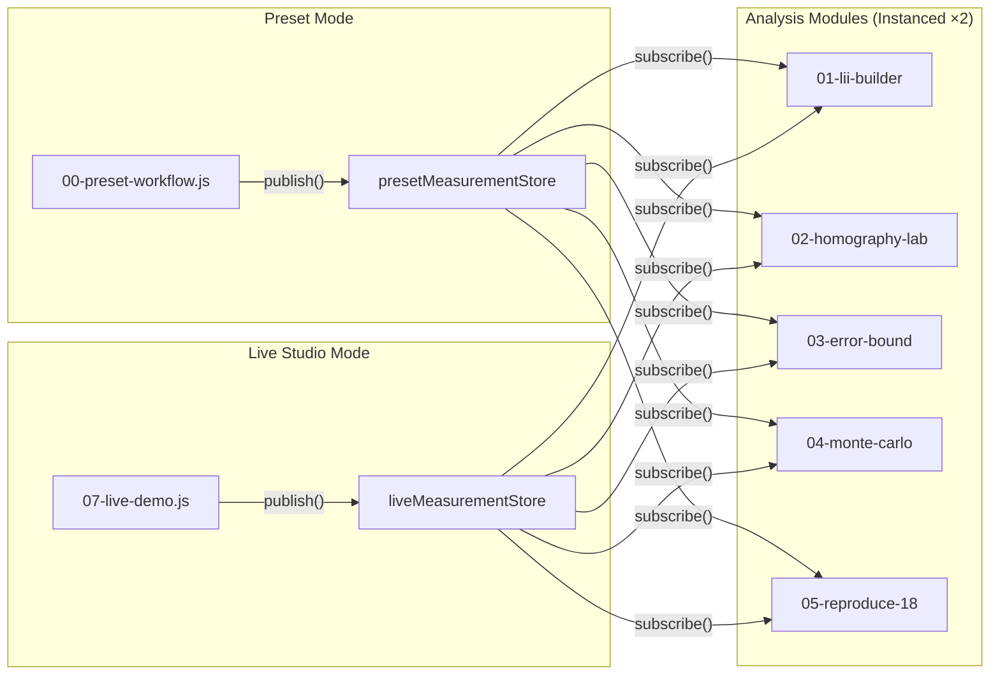

# Architecture — LII Lens Lab

> เอกสารสถาปัตยกรรมระบบ สำหรับนักพัฒนาและผู้ดูแลโครงการ
> ปรับปรุงล่าสุด: 2026-08-11

---

## 1. ภาพรวมสถาปัตยกรรม (Architecture Overview)

LII Lens Lab เป็น **Single-Page Application (SPA)** ที่ใช้ Vanilla JavaScript (ES Modules) ไม่มี Framework หนัก โดยแบ่งเป็น 3 Layer หลัก:

```
┌─────────────────────────────────────────────────────────────────┐
│                        index.html                               │
│                   (Semantic HTML Structure)                      │
├─────────────────────────────────────────────────────────────────┤
│                     Presentation Layer                           │
│   ┌───────────┐ ┌──────────────┐ ┌──────────┐ ┌─────────────┐  │
│   │ theme.js  │ │image-workspace│ │svg-render│ │ histogram.js│  │
│   │ icons.js  │ │   .js        │ │  er.js   │ │   drag.js   │  │
│   │           │ │              │ │          │ │             │  │
│   └───────────┘ └──────────────┘ └──────────┘ └─────────────┘  │
│   analysis-context.js (Scoped DOM Instances)                    │
├─────────────────────────────────────────────────────────────────┤
│                     Application Layer                            │
│   ┌────────────────┐  ┌─────────────────────────────────────┐   │
│   │  00-preset-     │  │  Modules 01–05 (Analysis Pipeline) │   │
│   │  workflow.js    │  │  01-lii-builder.js                 │   │
│   │                 │  │  02-homography-lab.js               │   │
│   │  07-live-       │  │  03-error-bound.js                  │   │
│   │  demo.js        │  │  04-monte-carlo.js                  │   │
│   │                 │  │  05-reproduce-18.js                 │   │
│   └────────┬────────┘  └─────────────────┬───────────────────┘   │
│            │      MeasurementStore        │                      │
│            └──────────┐ ┌────────────────┘                      │
│                       ▼ ▼                                        │
├─────────────────────────────────────────────────────────────────┤
│                       Core Layer                                 │
│   ┌───────────┐ ┌───────────┐ ┌───────────┐ ┌────────────────┐ │
│   │  math.js  │ │ matrix.js │ │homography │ │ calibration-   │ │
│   │           │ │           │ │   .js     │ │ session.js     │ │
│   └───────────┘ └───────────┘ └───────────┘ └────────────────┘ │
│   ┌─────────────────────┐ ┌───────────────────┐                 │
│   │ measurement-store.js│ │preset-session-     │                 │
│   │                     │ │  data.js           │                 │
│   └─────────────────────┘ └───────────────────┘                 │
│   ┌─────────────────────┐                                       │
│   │     data.js         │  (Test-only fixtures)                 │
│   └─────────────────────┘                                       │
└─────────────────────────────────────────────────────────────────┘
```

---

## 2. Tech Stack

| ด้าน | เทคโนโลยี |
|------|-----------|
| **Language** | JavaScript (ES2022+, ES Modules) |
| **Build Tool** | Vite 8 (`vite.config.js`, relative base `./`) |
| **Styling** | Vanilla CSS + CSS Custom Properties + Dark Mode Tokens |
| **Typography** | Self-hosted Anuphan Variable Font |
| **Icons** | Vendored Lucide icon-node registry (ไม่ใช้ CDN) |
| **Math Rendering** | KaTeX (loaded via CDN ใน `index.html`) |
| **Deployment** | GitHub Pages / Static Web Server |
| **Testing** | Custom test runner (`npm test`) บน Node.js |

---

## 3. โครงสร้างไดเรกทอรี (Directory Structure)

```
NakornSawan2569-Math-LII/
├── index.html                    # Main HTML entry (ทุก section/module มี markup ที่นี่)
├── vite.config.js               # Vite: base './', outDir 'dist', sourcemap true
├── package.json                 # Scripts: dev, build, preview, test
│
├── src/
│   ├── main.js                  # Bootstrap: init theme, mount modules, bind events
│   ├── style.css                # Primary CSS design system
│   ├── redesign.css             # UI override layer (image-workspace, professional polish)
│   │
│   ├── core/                    # ⚙️ Pure mathematical engine (ไม่ import DOM)
│   │   ├── math.js              # distance, lii, ae, re, fmt, clamp, mulberry32, randomInDisk
│   │   ├── matrix.js            # determinant3, inverse3, matMul, solveLinearSystem (Gaussian)
│   │   ├── homography.js        # applyHomography, transformPoints, validateQuadrilateral, estimateHomography (DLT)
│   │   ├── calibration-session.js  # calculateCalibration, projectWorldPoints, normalizedToPixels
│   │   ├── measurement-store.js # createMeasurementStore (pub/sub + localStorage persistence)
│   │   ├── preset-session-data.js  # PRESET_SESSION, PRESET_FRAMES, PRESET_PHASE_LABELS
│   │   └── data.js              # Canonical fixtures (S1–S6, H1–H3, PUBLISHED) — test-only
│   │
│   ├── ui/                      # 🎨 Presentation components (DOM-dependent)
│   │   ├── theme.js             # Light/Dark mode toggle + localStorage persistence
│   │   ├── icons.js             # Vendored Lucide SVG icon registry + refreshIcons()
│   │   ├── image-workspace.js   # Photo + SVG overlay layer (createImageWorkspace)
│   │   ├── svg-renderer.js      # 2D coordinate plot engine (renderPlot, boundsFor, svgMap)
│   │   ├── histogram.js         # Canvas histogram renderer (drawHistogram)
│   │   ├── drag.js              # Pointer/Touch drag interaction helper (attachDrag)
│   │   └── analysis-context.js  # Scoped DOM duplication for Preset/Live instances
│   │
│   ├── modules/                 # 📦 Feature modules (workflow + analysis)
│   │   ├── 00-preset-workflow.js   # Staged photo-calibration demo with playback
│   │   ├── 01-lii-builder.js       # Module 1: Confirmed LII coordinates & distance
│   │   ├── 02-homography-lab.js    # Module 2: Homography matrix & pixel→cm conversion
│   │   ├── 03-error-bound.js       # Module 3: 10ε error bound validation
│   │   ├── 04-monte-carlo.js       # Module 4: Random perturbation simulation
│   │   ├── 05-reproduce-18.js      # Module 5: Per-segment breakdown table
│   │   └── 07-live-demo.js         # Live Studio: camera/upload → DLT → measurement
│   │
│   └── tests/
│       ├── self-tests.js        # 36 automated mathematical + state-isolation tests
│       └── run-tests.js         # Node.js test runner entry point
│
├── public/
│   └── preset-dental-guide.png  # Static asset served by Vite
│
└── dist/                        # Production build output
```

---

## 4. Dual-Mode Architecture (สถาปัตยกรรมสองโหมด)

แอปพลิเคชันทำงานบน **2 โหมดอิสระ** ที่แชร์ analysis pipeline เดียวกัน:



### Key Design Decisions:
- **Module 1–5 จะถูก init 2 ครั้ง** — ครั้งหนึ่งสำหรับ Preset และอีกครั้งสำหรับ Live โดย `mountAnalysisInstances()` จะ clone DOM template และ re-prefix element IDs เป็น `live-*`
- **Measurement Store แยกกัน** — `presetMeasurementStore` และ `liveMeasurementStore` มี localStorage key ต่างกัน (`lii:measurement:preset` / `lii:measurement:live`) จึงไม่กระทบกัน
- **Snapshot-based data flow** — Module 1–5 ไม่เห็นข้อมูล realtime; จะอัปเดตก็ต่อเมื่อผู้ใช้กดปุ่ม "ประมวลผลไปยัง Module 1–5" ซึ่ง workflow module จะเรียก `store.publish()`

---

## 5. Data Flow Pipeline

### 5.1 Calibration Pipeline (ใช้ร่วมกันทั้ง Preset + Live)

```
┌──────────────────────────────────────────────────────────┐
│ INPUT                                                     │
│  • 4 corner points (C1–C4) ในพิกัด pixel                │
│  • 6 measurement points (Q1–Q6) ในพิกัด pixel           │
│  • Optional: 6 reference points (ground truth) ใน cm    │
│  • Target size (width × height) ใน cm                   │
└──────────────────────────┬───────────────────────────────┘
                           ▼
┌──────────────────────────────────────────────────────────┐
│ estimateHomography(worldCorners, imageCorners)            │
│  ↳ DLT 4-point → 8×8 linear system → Gaussian Elim.    │
│  ↳ Output: H_est (3×3 Homography Matrix)                │
└──────────────────────────┬───────────────────────────────┘
                           ▼
┌──────────────────────────────────────────────────────────┐
│ inverse3(H_est) → H_inv                                  │
│  ↳ Apply H_inv to Q1–Q6 image points                    │
│  ↳ Output: P̂1–P̂6 recovered world coordinates (cm)     │
└──────────────────────────┬───────────────────────────────┘
                           ▼
┌──────────────────────────────────────────────────────────┐
│ lii(P̂1–P̂6) = Σ distance(P̂_i, P̂_{i+1}) for i=1..5   │
│  ↳ Output: L_rec (recovered LII in cm)                  │
└──────────────────────────┬───────────────────────────────┘
                           ▼
┌──────────────────────────────────────────────────────────┐
│ If reference points exist:                                │
│  ε = max(distance(P̂_i, R_i)) for i=1..6                │
│  actualError = |L_rec − L_0|                             │
│  bound = 10ε                                             │
│  passed = actualError ≤ bound                            │
└──────────────────────────────────────────────────────────┘
```

### 5.2 Pub/Sub Pattern (MeasurementStore)

```javascript
// ใน core/measurement-store.js
createMeasurementStore({ source, label, storageKey })
  → { publish(measurement), subscribe(listener), get() }
```

- **publish()**: deep-clone measurement → เก็บใน memory + localStorage → notify all subscribers
- **subscribe()**: ลงทะเบียน listener + ส่ง current measurement ทันทีถ้ามี (late subscriber support)
- **get()**: return deep-cloned current measurement (immutable copy)

---

## 6. รายละเอียด Core Layer

### 6.1 `math.js` — Mathematical Primitives

| Function | Purpose |
|----------|---------|
| `distance(a, b)` | Euclidean distance between 2D points |
| `lii(pts)` | Sum of 5 consecutive segment distances (Polyline Path Length Model) |
| `ae(a, b)` | Absolute error |
| `re(estimate, truth)` | Relative error (%) |
| `fmt(v, d)` | Format number to fixed decimals with NaN guard |
| `clamp(x, min, max)` | Numeric clamping |
| `mulberry32(seed)` | Seeded 32-bit PRNG (deterministic) |
| `randomInDisk(radius, rng)` | Uniform random point inside disk of given radius |

### 6.2 `matrix.js` — Linear Algebra

| Function | Purpose |
|----------|---------|
| `determinant3(m)` | 3×3 matrix determinant |
| `inverse3(m)` | 3×3 matrix inverse via cofactor expansion |
| `matMul(a, b)` | General matrix multiplication |
| `solveLinearSystem(A, b)` | Gaussian elimination with partial pivoting (n×n) |

### 6.3 `homography.js` — Projective Geometry

| Function | Purpose |
|----------|---------|
| `applyHomography(p, m)` | Project point through 3×3 homography |
| `transformPoints(pts, m)` | Batch point transformation |
| `validateQuadrilateral(points)` | Convexity + minimum-area check for 4 corners |
| `estimateHomography(src, dst)` | 4-point DLT: build 8×8 system → solve → 3×3 H matrix |

### 6.4 `calibration-session.js` — Shared Calibration Engine

| Function | Purpose |
|----------|---------|
| `createWorldCorners(w, h)` | Generate canonical world rectangle `[[0,0],[w,0],[w,h],[0,h]]` |
| `normalizedToPixels(pts, w, h)` | Convert normalized [0,1] coordinates to pixel space |
| `projectWorldPoints(corners, worldPts)` | Project world points to image space via estimated H |
| `calculateCalibration({...})` | **Main pipeline**: estimate H → invert → recover points → compute LII → validate bound |

---

## 7. รายละเอียด Application Layer (Modules)

### Module 00: Preset Workflow (`00-preset-workflow.js`)
- **หน้าที่**: สาธิต calibration pipeline ทีละขั้นตอนด้วยภาพถ่ายและจุดอ้างอิงที่กำหนดไว้ล่วงหน้า
- **Feature**: Staged playback (13 frames), auto-play timer, overlay toggle, draggable Q points
- **Output**: `presetMeasurementStore.publish()` เมื่อกดยืนยัน

### Module 07: Live Demo (`07-live-demo.js`)
- **หน้าที่**: Interactive workspace สำหรับถ่ายภาพจริงหรือ upload → กำหนด C1–C4 → Q1–Q6
- **Feature**: Camera API (environment-facing), file upload/drag-drop, custom calibration size, undo, expand
- **Step flow**: Select Image → Mark 4 Corners → Mark 6 Points → View Results → Publish to Modules
- **Output**: `liveMeasurementStore.publish()` เมื่อกดยืนยัน

### Module 01: LII Builder (`01-lii-builder.js`)
- แสดงพิกัด Q1–Q6 ที่กู้คืนแล้ว, ระยะแต่ละช่วง, LII รวม, และ Δ จาก reference

### Module 02: Homography Lab (`02-homography-lab.js`)
- แสดง 3 plots: raw pixel, recovered cm, reference overlay
- แสดง H matrix, determinant, raw pixel length, recovered LII, relative error

### Module 03: Error Bound (`03-error-bound.js`)
- คำนวณ ε (max point displacement), actual error, 10ε bound
- แสดง PASS/FAIL status พร้อม visual meter
- ภาพ user-uploaded จะแสดง "MEASUREMENT ONLY" เพราะไม่มี ground truth

### Module 04: Monte Carlo (`04-monte-carlo.js`)
- สุ่มรบกวนจุดภายใน disk radius ε จำนวน N ครั้ง (default 1000)
- ใช้ `mulberry32` PRNG สำหรับ deterministic reproducibility
- แสดง histogram บน Canvas + สถิติ mean, SD, P95, max, pass rate
- ใช้ async batching (500 per batch) เพื่อไม่ block UI thread

### Module 05: Reproduce-18 (`05-reproduce-18.js`)
- แจกแจง segment-by-segment: pixel distance, calibrated cm, cumulative LII, percentage

---

## 8. รายละเอียด Presentation Layer (UI)

### 8.1 `image-workspace.js` — Photo + SVG Overlay System
- สร้าง `` + `<svg>` overlay ซ้อนกัน
- SVG overlay แสดง: calibration quadrilateral, corner labels/coordinates, dimension arrows, measurement polyline, draggable point circles
- **iPad & Touch Optimization**:
  - แผงควบคุม **Precision Nudge D-Pad (`.workspace-nudge-pad`)** บนหน้าจอสำหรับขยับจุดที่เลือกทีละ `1px` หรือ `5px` โดยไม่ต้องใช้คีย์บอร์ด PC
  - **Dynamic Touch Loupe Offset**: แว่นขยายจะขยายขนาดเป็น `160px` และลอยสูงขึ้นเหนือจุดสัมผัส 65px เพื่อไม่ให้นิ้วมือบังขอบฟันขณะลากจุด
  - **Enlarged Touch Targets**: ขยายพื้นที่สัมผัสของจุด SVG (`.point-hit-target`) เป็นรัศมีอย่างน้อย `22px` (> 44px hit diameter)
  - **Touch Mode Pill Toggle**: ปุ่มสลับโหมด `[ 📍 โหมดปรับจุด ]` vs `[ ✋ โหมดเลื่อนภาพ ]` เด่นชัดบน Toolbar
- รองรับ pointer/touch events: click to place, drag to move, touch nudge D-Pad, keyboard arrow keys
- `ResizeObserver` สำหรับ re-render เมื่อ container resize

### 8.2 `svg-renderer.js` — 2D Plot Engine
- คำนวณ coordinate mapping (data space ↔ SVG space) ด้วย `boundsFor()` + `svgMap()`
- `renderPlot()`: draw grid, polylines, circles, labels สำหรับ multiple data series

### 8.3 `analysis-context.js` — DOM Instance Cloning
- **ปัญหา**: Module 1–5 ต้องมี 2 instances (Preset + Live) แต่ HTML template มีชุดเดียว
- **แก้ไข**: `mountAnalysisInstances()` clone innerHTML ของ preset root ไปยัง live root แล้ว re-prefix IDs (`live-*`), `for` attributes, `href` anchors
- `getAnalysisElement(root, id)` ใช้ `data-analysis-id` attribute แทน DOM `id` เพื่อ scope isolation

### 8.4 `theme.js` — Dark Mode System
- ตรวจ `prefers-color-scheme` ของ OS เป็นค่าเริ่มต้น
- persist ด้วย localStorage key `lii_lens_lab_theme`
- set `data-theme` attribute บน `<html>` → CSS Custom Properties จัดการสีทั้งหมด

### 8.5 `icons.js` — Vendored Lucide Icons
- เก็บ SVG node definitions เป็น JS array (ไม่ใช้ CDN/npm runtime)
- `refreshIcons(root)` scan `[data-lucide]` elements แล้ว replace ด้วย inline SVG

---

## 9. State Management

แอปใช้ **minimal state** โดยไม่มี global state manager:

| State | Location | Scope |
|-------|----------|-------|
| Theme preference | `localStorage['lii_lens_lab_theme']` | Global |
| Preset measurement snapshot | `localStorage['lii:measurement:preset']` + in-memory | Preset mode |
| Live measurement snapshot | `localStorage['lii:measurement:live']` + in-memory | Live mode |
| Preset workflow frame index | Local variable ใน `initPresetWorkflow()` closure | Preset module |
| Live demo step/points/result | Module-level variables ใน `07-live-demo.js` | Live module |
| Module 1–5 data | Local variables ใน each init closure | Per-instance |

### Immutability Pattern
`measurement-store.js` deep-clone ทุกครั้งที่ `publish()`, `subscribe()`, และ `get()` เพื่อป้องกัน mutation ข้ามโมดูล

---

## 10. Build & Deployment

```bash
npm run dev      # Vite dev server (HMR) — http://localhost:5173
npm run build    # Production bundle → dist/
npm run preview  # Preview production build
npm test         # Run 36 self-tests via Node.js
```

### Vite Configuration
```javascript
export default defineConfig({
  base: './',        // Relative paths สำหรับ GitHub Pages
  build: {
    outDir: 'dist',
    sourcemap: true  // Debug production issues
  }
});
```

---

## 11. Testing Architecture

- **Framework**: Custom lightweight test runner (ไม่ใช้ Jest/Mocha)
- **จำนวน**: 36 tests ใน `self-tests.js`
- **ขอบเขต**:
  - Tests 1–2: Basic math (distance)
  - Tests 3–8: LII dataset-reference consistency (S1–S6)
  - Tests 9–11: Determinant accuracy (H1–H3)
  - Tests 12–14: Matrix inverse property (H·H⁻¹ = I)
  - Tests 15–16: Canonical S3+H2 distortion/recovery
  - Test 17: All 18 conditions recover to floating-point precision
  - Tests 18–19: Error functions + PRNG disk sampler
  - Tests 20–23: DLT Homography estimation (identity, scale, perspective, inverse)
  - Test 24: 10ε theorem under 1000 random perturbations
  - Test 25: Published results table integrity
  - Tests 26–27: Quadrilateral validation (convex/crossing)
  - Tests 28–36: Shared calibration pipeline, preset workflow, rectangular calibration, store isolation

- **`data.js` เป็น test-only**: ชุดตัวเลข S1–S6, H1–H3, PUBLISHED ไม่ถูก import ใน runtime ของหน้าเว็บ

---

## 12. Mathematical Foundation

### ทฤษฎีบทหลัก: 10ε Error Bound

$$\left| \hat{L} - L_0 \right| \le 10\varepsilon$$

- **$L_0$**: LII ที่แท้จริง (ground truth) = ผลรวมระยะทาง 5 ช่วงจาก 6 จุด
- **$\hat{L}$**: LII ที่คำนวณจากจุดที่กู้คืน
- **$\varepsilon$**: max displacement ของจุดที่กู้คืนเทียบกับจุดจริง

### พิสูจน์โดยสังเขป:
สำหรับแต่ละช่วง $i$, โดย Triangle Inequality:
$$|d(\hat{P}_i, \hat{P}_{i+1}) - d(P_i, P_{i+1})| \le d(\hat{P}_i, P_i) + d(\hat{P}_{i+1}, P_{i+1}) \le 2\varepsilon$$

ผลรวม 5 ช่วง:
$$|\hat{L} - L_0| \le 5 \times 2\varepsilon = 10\varepsilon$$

### Homography (DLT Algorithm):
- สร้างระบบสมการเชิงเส้น 8×8 จาก 4 คู่จุด (src → dst)
- แก้ด้วย Gaussian Elimination with Partial Pivoting
- ได้ H matrix 3×3 ที่ H[2][2] = 1 (normalized)

---

## 13. CSS Architecture

### Dual CSS Files:
1. **`style.css`** (24KB): Primary design system — CSS Custom Properties, Dark Mode tokens, responsive grid, typography, component styles
2. **`redesign.css`** (20KB): Professional UI overrides — image-workspace layout, enhanced visual polish

### Theming Strategy:
```css
[data-theme="dark"] {
  --bg-primary: #0f172a;
  --text-primary: #f1f5f9;
  /* ... 50+ tokens */
}
```
ใช้ `data-theme` attribute บน `<html>` เปลี่ยนสีทั้งหมดผ่าน CSS Custom Properties

---

## 14. ข้อจำกัดและ Guardrails

1. **ไม่ใช่เครื่องมือทางการแพทย์** — เป็น Mathematical Proof of Concept เท่านั้น
2. **Planar assumption** — Homography สมมติว่าทุกจุดอยู่บนระนาบ 2D เดียวกัน
3. **ไม่มี auto-detection** — ผู้ใช้ต้องกำหนดจุดเอง (ไม่มี computer vision)
4. **Browser-only computation** — ไม่มี backend; ทุกอย่างคำนวณใน client
5. **ภาพ user-uploaded ไม่มี ground truth** — ระบบแสดง "MEASUREMENT ONLY" ไม่สรุป PASS/FAIL
